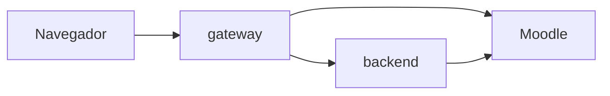

# UBUMonitorWeb


Adaptación web de **UBUMonitor**, herramienta de analítica de aprendizaje (learning analytics) sobre Moodle. Permite a un profesor iniciar sesión contra su Moodle, elegir un curso, descargar los logs de actividad de los estudiantes y visualizarlos en distintos tipos de gráfico.

## Funcionalidades

- 🔐 Login contra Moodle, con **token manual** o con **SSO institucional** (usuario/contraseña + verificación en dos pasos por email).
- 📚 Listado de los cursos del usuario y detalle de cada curso: participantes (con foto, filtrables por rol/grupo) y componentes/eventos/secciones/módulos.
- ⬇️ Descarga de los logs de actividad del curso, de forma **automática** (clave de autologin de Moodle, sin ventanas emergentes) o **manual** (CSV descargado a mano), con una **caché local cifrada** (IndexedDB + AES-GCM) para no repetir la descarga en cada visita.
- 📈 Visualización de esos logs en gráficos: línea temporal, tabla de eventos, total de eventos por usuario y mapa de calor — filtrables por participante, rol/grupo, componente/evento y rango de fechas.
- 🌐 Traducción al español de los componentes y eventos de Moodle que aparecen en el CSV de logs.

## Arquitectura 🏗️

Tres partes independientes:



- **[`front/ubumonitor-web/`](front/ubumonitor-web)** — interfaz completa (React + Vite): login, listado de cursos, detalle de curso con gráficos, descarga de logs.
- **[`gateway/`](gateway)** — servidor Node.js que solo usa módulos nativos (`http`, `https`, `fs`, `crypto`). En desarrollo no hace falta (Vite tiene sus propios proxies); sirve para ejecutar la app ya compilada como un único proceso, haciendo de proxy hacia el backend y hacia Moodle, y para el login SSO.
- **[`api_rest/moodle-openapi-adapter/`](https://github.com/UBUMonitor/moodle-openapi-adapter)** — submódulo git, backend Spring Boot que traduce las llamadas REST del front a las llamadas del webservice de Moodle.

## Construido con 🛠️

**Frontend**
* [React](https://react.dev/) 19.2
* [Vite](https://vite.dev/) 8
* [React Router](https://reactrouter.com/) 7.15
* [Axios](https://axios-http.com/) 1.15
* [Recharts](https://recharts.org/) 3.8 - gráficos
* [i18next](https://www.i18next.com/) / react-i18next - traducción

**Backend** (submódulo, ver [Autoría](#autoría-✒️))
* [Spring Boot](https://spring.io/projects/spring-boot) 3.5 (WebFlux)
* Java 25
* [MapStruct](https://mapstruct.org/) + [Lombok](https://projectlombok.org/)
* OpenAPI Generator + JSON Schema2POJO - generan el cliente/modelos a partir del esquema del webservice de Moodle

**Gateway**
* [Node.js](https://nodejs.org/) - sin dependencias externas, solo módulos nativos (`http`, `https`, `fs`, `crypto`, `node:sea`)

## Cómo arrancar en desarrollo 🚀

Requisitos: JDK 25, Maven, Node.js, y un Moodle accesible (local o remoto) con el servicio web "Moodle mobile" (`moodle_mobile_app`) activado.

Los scripts de arranque son `.bat` (**solo Windows**):

```bat
arrancar.bat
```

Arranca el backend (`api_rest/moodle-openapi-adapter`, puerto 8080) y el front en modo desarrollo (`front/ubumonitor-web`, puerto 5173, con hot-reload de Vite).

Para probar el flujo cercano a producción (front ya compilado, servido por el gateway):

```bat
arrancar-gateway.bat
```

Compila el front, arranca el backend y arranca el gateway (puerto 4000).

## Autoría ✒️

- **[Óscar Merino Martínez](https://github.com/oskitar04)** — frontend (`front/`) y gateway (`gateway/`).
- **Yi Peng Ji** — backend (`api_rest/moodle-openapi-adapter/`), incluido como submódulo git y usado tal cual como adaptador REST hacia Moodle.

## Licencia 📄


Este repositorio (`front/` y `gateway/`) está bajo licencia [MIT](LICENSE). El submódulo `api_rest/moodle-openapi-adapter` tiene su propia licencia MIT independiente (ver [su LICENSE](https://github.com/UBUMonitor/moodle-openapi-adapter/blob/84e73a4/LICENSE)).

